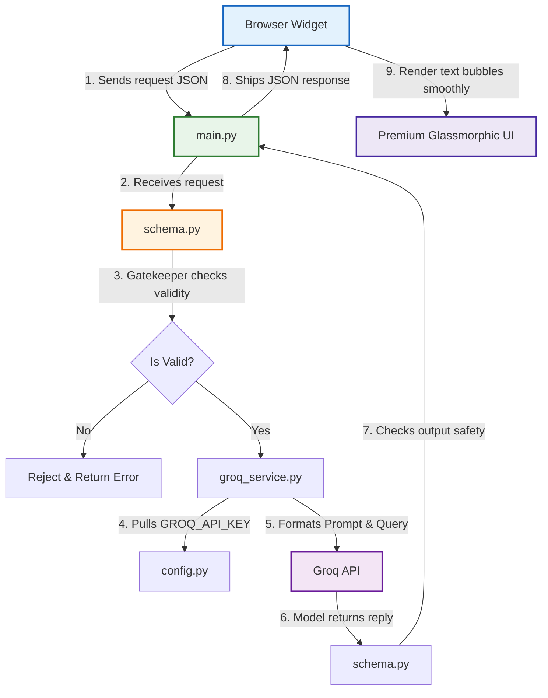
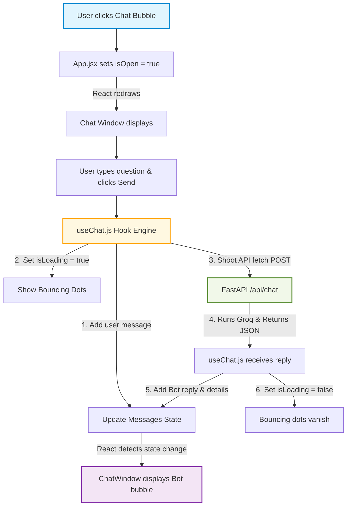

> [!TIP]
> **If you are new to full-stack, this is the single most important lesson to master.**

---

### The Reality: We *could* put everything in one file. So why don't we?

If we were lazy, we could dump all the backend code into a single file called `main.py`. It would run. But as soon as you went to deploy it or make a single tweak, you would hit the **"Single-File Spaghetti Nightmare."**

Here is why keeping things separated into our proposed folders is actually **much easier** for you to build, maintain, and learn:

---

### 1. The "Single-File Spaghetti" vs. "LEGO Blocks"

If everything is in `main.py`, that single file has to do **5 completely different jobs** at the same time:

1. Load environment variables.
2. Verify security settings (CORS) so the browser allows the connection.
3. Validate that incoming messages are not empty or malicious.
4. Manage the system prompt (Cognoid's business details) and connect to Groq.
5. Define the web URLs (endpoints) like `/api/chat`.

> [!WARNING] **The Disaster**
> Imagine you want to tweak the chatbot's system prompt to say Cognoid is now open until 7 PM instead of 6 PM. You open your giant `main.py`, search through hundreds of lines of server configurations, find the prompt, and change it. But by accident, **you delete a single comma or parenthesis in the server routing section.**
> 
> Suddenly, your entire server won't start. A simple business update just broke your entire web application.

> [!SUCCESS] **The LEGO Solution (Separation of Concerns)**
> By separating the folders, we treat our code like LEGO blocks. Each file has **exactly one job**. If you want to change the chatbot's personality, you go to `groq_service.py` and edit it. You don't touch `main.py`. You have **0% chance** of accidentally breaking your web server.

---

### 2. File-by-File Breakdown: What is the "Job" of each file?

Let's look at our proposed files and map them to a **real-world analogy: A High-End Doctor's Clinic.**

```text
cognoid-chatbot/
└── backend/
    └── app/
        ├── config.py         <-- [The Secretary]
        ├── schema.py         <-- [The Nurse / Gatekeeper]
        ├── services/
        │   └── groq_service.py <-- [The Specialized Doctor]
        └── main.py           <-- [The Front Desk Coordinator]
```

> [!INFO] 🏢 **`config.py` — *The Secretary***
> - **What it does:** Reads the `.env` file and makes sure the keys (`GROQ_API_KEY`, `WHATSAPP_NUMBER`) actually exist and are valid.
> - **Why it's separate:** If you forget to set your API Key, this file throws a clean error **immediately** when you start the server: *"Hey! You forgot your Groq Key!"*. If we didn't have this, the server would start normally, but the moment a user tried to chat, it would silently crash mid-conversation with an ugly "Internal Server Error."

> [!INFO] 📋 **`schema.py` — *The Nurse / Gatekeeper***
> - **What it does:** Uses a library called **Pydantic** to inspect the data coming in and going out. It says: *"A valid request must look exactly like this: `{"message": "text"}`."*
> - **Why it's separate:** If a hacker tries to send random code or massive blank files to your server, `schema.py` catches it instantly at the door and rejects it **before** it even reaches your AI model. This saves you money (prevents wasted API calls) and protects your server from exploits.

> [!INFO] 🧠 **`services/groq_service.py` — *The Specialized Doctor***
> - **What it does:** Connects to Groq, manages the Cognoid system prompt, keeps the history of the conversation, and returns the response.
> - **Why it's separate:** This is the "AI Brain." You will be modifying the prompt and business details *a lot* to get the chatbot's behavior perfect. By isolating it, your AI logic is completely insulated from the web-handling code.

> [!INFO] 🚦 **`main.py` — *The Front Desk Coordinator***
> - **What it does:** Sets up the FastAPI server, handles CORS policies (tells the browser: *"Only allow requests from my deployed React site"*), and defines the `/api/chat` URL route.
> - **Why it's separate:** It doesn't care *how* Groq works, and it doesn't care *what* your prompt says. Its only job is to hear the incoming browser request, hand it to the Gatekeeper (`schema`), pass it to the Doctor (`groq_service`), and hand the answer back.

---

### 3. How a Single Chat Message Travels (The Connection Flow)

When a user visits [www.cognoid.in](https://www.cognoid.in/) and types: *"What services do you offer?"*, here is how our folder layout coordinates the journey:



```text
[Browser Widget] 
       │ (1. Sends: {"message": "What services do you offer?"})
       ▼
  [main.py] (2. Receives the web request)
       │
       ▼
 [schema.py] (3. Gatekeeper checks: "Is this a valid request format?") ───► [Invalid] ──► Reject!
       │ 
       ▼ [Valid]
[groq_service.py] (4. Pulls GROQ_API_KEY from config.py)
       │ (5. Formats the System Prompt + User Query)
       ▼
   [Groq API] (6. Model returns: {"reply": "...", "show_whatsapp": false})
       │
       ▼
 [schema.py] (7. Double-checks that Groq's output format is perfectly safe)
       │
       ▼
  [main.py] (8. Ships the clean JSON response back to browser)
       │
       ▼
[Browser Widget] (9. Render text bubbles smoothly with premium glassmorphic UI)
```

---

### Why this is a Superpower for You as a Learner:

1. **It's Readable:** Instead of reading one file with 500 lines of mixed code, you read four clean files of 40–80 lines each.
2. **It's Standard:** This is *exactly* how tech giants like Netflix, Uber, or Stripe write their code. You are learning **production-grade engineering** from Day 1, not just "hackathon scripts."
3. **It's Debuggable:** If your API key is broken, you know to look *only* at `config.py`. If your prompt is giving bad answers, you look *only* at `groq_service.py`.

---

# Front End

By understanding this frontend blueprint, you can guide Claude to build perfect, bug-free React code because you will be instructing it where to place each feature!

Here is the conceptual guide to our React chatbot frontend, structured specifically for your architectural understanding.

---

### 1. The Core Philosophy of React

Before looking at folders, understand React’s two core laws:

1. **LEGO Blocks (Components):** React divides a website into tiny, isolated visual pieces called **Components** (e.g. a Button, an Input, a Chat Window).
2. **State (The App's Memory):** Components can have memory. For example: *Is the chat open? What messages are currently on the screen? Is the bot typing?* This memory is called **State**. When a state changes, React instantly redraws only that specific part of the screen.

---

### 2. The Frontend Directory: File-by-File Breakdown

Let's use a **Smart House** analogy to explain exactly why each file exists and how they connect:

```text
cognoid-chatbot/
└── frontend/
    ├── index.html       <-- [The Land / Empty Foundation]
    └── src/
        ├── main.jsx     <-- [The Main Power Line]
        ├── App.jsx      <-- [The Master Control Panel]
        ├── index.css    <-- [The Interior Design & Paint]
        ├── components/  <-- [The Custom Furniture]
        │   ├── ChatBubble.jsx
        │   ├── ChatWindow.jsx
        │   ├── ChatMessage.jsx
        │   └── WhatsAppButton.jsx
        └── hooks/       <-- [The Plumbing & Network Engine]
            └── useChat.js
```

---

> [!INFO] 🏗️ **`index.html` — *The Land / Empty Foundation***
> - **Concept:** A tiny, completely standard HTML file. Inside it is just one empty tag: `<div id="root"></div>`.
> - **Function:** This is the designated spot on the website where the chatbot will mount. It’s like buying an empty plot of land and designating it for the house.

> [!INFO] 🔌 **`main.jsx` — *The Main Power Line***
> - **Concept:** The file that runs first.
> - **Function:** It grabs your React code and "plugs" it directly into the `<div id="root"></div>` of `index.html`. It acts as the electrical connection between standard HTML and React.

> [!INFO] 🎛️ **`App.jsx` — *The Master Control Panel***
> - **Concept:** The shell of your chatbot. It tracks the most basic memory state: **`isOpen` (Is the chat window open or closed?)**
> - **Function:**
>     - If `isOpen` is `false` ──► Render *only* the floating **Chat Bubble** in the bottom-right corner.
>     - If `isOpen` is `true` ──► Render the **Chat Window** (the full screen conversation panel).

> [!INFO] 🛋️ **`components/` — *The Visual Furniture***
> These are standard visual blocks. They are "dumb" components—they don't care about APIs or servers. They only display what they are told to display:
> - **`ChatBubble.jsx`:** The round floating button with a chat icon. When clicked, it flips `isOpen = true` in `App.jsx`, popping open the chat.
> - **`ChatWindow.jsx`:** The main layout frame. It holds the Header (Cognoid logo), the scrollable Message Area (where bubbles sit), and the Input footer (text box + Send button).
> - **`ChatMessage.jsx`:** A single text bubble. If sent by `user`, it styles it blue and aligns it right. If sent by `bot`, it styles it dark gray, aligns it left, and handles the smooth entry animation. It also renders the bouncing "..." typing dots if the bot is thinking.
> - **`WhatsAppButton.jsx`:** A custom glowing CTA button. If the bot says *"Click to connect on WhatsApp"*, this renders a direct external link with a sleek icon.

> [!INFO] 🚰 **`hooks/useChat.js` — *The Plumbing & Network Engine***
> - **Concept:** This is the **most important file**! It acts as the pipeline that connects your visual React layout to your private FastAPI backend.
> - **Function:** It handles the state for:
>     1. `messages`: An array (list) of all the messages typed so far.
>     2. `isLoading`: A boolean tracking if the API is currently thinking.
>     3. `sendMessage`: A function that sends the text to the backend.

---

### 3. How a Single Chat Travels: The Event Flow

When a user typed *"What services do you offer?"*, here is how our frontend coordinates the journey step-by-step:



```text
[User clicks Chat Bubble]
       │
       ▼
 [App.jsx] sets 'isOpen = true'
       │
       ▼ (React instantly redraws the Chat Window on screen)
[User types question and clicks "Send"]
       │
       ▼
[useChat.js] (The Hook Engine)
       │───► 1. Adds user's message to 'messages' state (instantly renders on screen)
       │───► 2. Sets 'isLoading = true' (renders bouncing dots)
       │───► 3. Shoots a secure 'fetch(POST)' network call to FastAPI (/api/chat)
       │
       ▼
 [FastAPI Backend] ──► Runs Groq ──► Returns JSON Response
       │
       ▼
[useChat.js] (Receives JSON reply)
       │───► 1. Adds Bot's reply (and WhatsApp link details) to 'messages' state
       │───► 2. Sets 'isLoading = false' (bouncing dots instantly vanish)
       │
       ▼ (React detects state changes and redraws)
[ChatWindow] displays the Bot's beautiful text bubble!
```

---

### Why this makes you an AI Prompting Master:

When you open Claude Code to write your UI, you won't need to struggle with the details. You can instruct Claude with extreme precision:

> *"Claude, I have a custom React Hook `useChat.js` that exposes `messages`, `isLoading`, and `sendMessage(text)`. Build me a React component `ChatWindow.jsx` that links its Send button to `sendMessage` and loops over `messages` to render `ChatMessage` components. Make the design premium glassmorphism."*

This guarantees Claude produces **clean, modular, bulletproof code** rather than a giant mess of styling mixed with network fetch requests.

Now that we have fully mapped out the conceptual architecture of both the backend (FastAPI) and frontend (React/Vite), **are you ready to approve the implementation plan so we can begin coding the backend steps?**

---

> [!NOTE]
> **It is incredibly satisfying when the pieces click together!** What you are realizing is that code files (`main.py`, `App.jsx`) are like the **engine and wheels** of a car—but a car also needs a gas tank, dashboard settings, a registration card, and a user manual to actually run on public roads.
> 
> Those "leftout" files in the folder are the **Critical Support & Infrastructure Files**. They don't run when a user chats, but they are absolutely essential for **installing, configuring, running, and deploying** your application.
> 
> Here is the direct breakdown of what each support file does and why it is there:

---

### 1. Backend Support Files

#### 📝 **`backend/.env.example` — *The Blueprint of Secrets***
- **What it is:** A plain text template that looks like this:
    ```env
    GROQ_API_KEY=your_groq_key_here
    WHATSAPP_NUMBER=your_whatsapp_number_here
    ```
- **Why it exists:** We **never** save real API keys inside our code or upload them to Git/GitHub (anyone could steal them and run up massive bills). Instead, we upload this template (`.env.example`). When you set up the project on a new computer, you copy this template, rename it to `.env` (which is secret and ignored by Git), and put your actual private keys inside.

#### 🛒 **`backend/requirements.txt` — *The Python Shopping List***
- **What it is:** A text file containing the names and versions of the third-party Python packages we need:
    ```txt
    fastapi==0.110.0
    uvicorn==0.28.0
    groq==0.5.0
    python-dotenv==1.0.1
    ```
- **Why it exists:** Instead of forcing you to manually type `pip install fastapi`, `pip install groq`, etc., you run one single command: `pip install -r requirements.txt`. Python reads this file and installs all your dependencies instantly.

---

### 2. Frontend Support Files

#### 🪪 **`frontend/package.json` — *The JavaScript ID Card & Blueprint***
- **What it is:** The single most important configuration file in any React/Node.js project.
- **Why it exists:** It acts as two things:
    1. **The Frontend Shopping List (`dependencies`):** Lists everything we need to build the UI (like React and Vite).
    2. **Shortcuts (`scripts`):** It maps complex commands to simple words. For example, instead of typing a long command to start a local server, we just type **`npm run dev`**. To package it for Vercel, we type **`npm run build`**.

#### ⚙️ **`frontend/vite.config.js` — *The React Factory Settings***
- **What it is:** The settings file for **Vite** (the modern tool that compiles and runs React).
- **Why it exists:** It tells Vite how to bundle and compress your React code. It says: *"We are using React. Compile our files so they are extremely small, secure, and load instantly in a fraction of a second when a user visits the website."*

---

### 3. Root Level Files

#### 🚀 **`embed-snippet.js` — *The Delivery Drone (Shadow DOM Injector)***
- **What it is:** A short, pure JavaScript file (no React, just pure browser-native JS).
- **Why it exists:** This is the magic snippet you give to Cognoid. They just copy-paste this one line onto their website:
    ```html
    <script src="https://your-chatbot-url.com/embed-snippet.js" defer></script>
    ```
- **How it works:** When the website loads, this script flies in like a delivery drone. It creates a **Shadow DOM** container (a locked bubble in HTML that blocks parent website styles from messing up our chat styling) and mounts your React Chatbot inside it. This is how we make our chatbot embeddable anywhere without breaking the host website's look!

#### 📖 **`README.md` — *The User Manual***
- **What it is:** A standard Markdown file showing developers how to install, configure, run, and deploy the chatbot step-by-step.

---

### Now you have the 100% complete picture! 🎓

You understand:
1. **Frontend (React/Vite)**: The beautiful visual layout, buttons, and state engine.
2. **Backend (FastAPI)**: The private, secure server that talks to Groq and validates the request.
3. **Support Files**: The setup scripts, secret templates, and shopping lists that wire everything together.