# Cognoid AI Chatbot Frontend Study Guide

Welcome to your comprehensive frontend study guide! This document is designed to take you from a complete beginner to a confident architect of your React and Vite-based chatbot interface. 

Instead of treating the frontend like a collection of mysterious black boxes, we will break down every single concept, file, and data pipeline using real-world analogies and your actual project code.

---

## 1. What is a "Front End" and What are its Basics?

At its simplest, the **frontend** (or client-side) is everything a user sees, hears, touches, and interacts with on their screen. If the backend is the hidden engine room under a cruise ship, the frontend is the beautiful deck, the steering wheel, and the passenger lounge.

Every modern frontend is built on three foundational technologies:
1. **HTML (HyperText Markup Language):** The **Skeleton**. HTML defines the structure and layout of the page (e.g., "here is a header," "here is a paragraph," "here is an input box").
2. **CSS (Cascading Style Sheets):** The **Skin and Styling**. CSS controls how everything looks—colors, margins, typography, glowing gradients, hover effects, and modern responsive grids.
3. **JavaScript (JS):** The **Muscles and Brain**. JS adds logic and interactivity (e.g., "when this button is clicked, open a menu," "fetch data from a server," "validate this text").

### Why Do We Use React?
Writing pure JavaScript for complex interfaces gets messy fast because you have to manually search, create, and insert HTML elements into the browser page (called **DOM manipulation**). 

**React** changes this by introducing two key superpowers:
- **LEGO Blocks (Components):** React lets you break down a complex user interface into small, isolated, reusable files called **Components** (like [ChatBubble.jsx](file:///c:/Users/Krishna/Desktop/Cognoid%20Soln/frontend/src/components/ChatBubble.jsx) or [WhatsAppButton.jsx](file:///c:/Users/Krishna/Desktop/Cognoid%20Soln/frontend/src/components/WhatsAppButton.jsx)).
- **State (Memory):** In React, you don't manually draw elements. Instead, you declare the **State** (the app's memory, such as `isOpen = true` or `messages = [...]`). You write your HTML/CSS to reflect that state, and whenever the state changes, React **instantly and automatically redraws (re-renders)** only the affected parts of the screen.

### Why Do We Use Vite?
Browsers can't run modern React or TypeScript code directly; it needs to be compiled, optimized, and bundled. **Vite** is a state-of-the-art developer tool that does this in milliseconds. It provides a lightning-fast development server with **Hot Module Replacement (HMR)**—meaning when you change a line of styling or text, it reflects on your local browser window instantly without resetting the page state.

---

## 2. Tour of Your Frontend Directory
Here is your frontend file structure. Let's see how each file acts like a part of a **Smart House**:

```text
cognoid-chatbot/
└── frontend/
    ├── index.html       <-- [The Land / Empty Plot]
    ├── vite.config.js   <-- [The Builder's Blueprint]
    ├── package.json     <-- [The Materials Shopping List]
    └── src/
        ├── main.jsx     <-- [The Main Electrical Service Entrance]
        ├── App.jsx      <-- [The Central Smart Controller]
        ├── index.css    <-- [The Interior Design System]
        ├── hooks/
        │   └── useChat.js   <-- [The Under-floor Plumbing & Pumps]
        └── components/  <-- [The Visual Furniture & Appliances]
            ├── ChatBubble.jsx
            ├── ChatWindow.jsx
            ├── ChatMessage.jsx
            └── WhatsAppButton.jsx
```

### File-by-File Breakdown:

#### 🏗️ [index.html](file:///c:/Users/Krishna/Desktop/Cognoid%20Soln/frontend/index.html) — *The Land / Empty Plot*
A tiny, standard webpage. It has no text or buttons. Instead, it contains a single empty tag: `<div id="root"></div>`. This is the designated plot of land where React will build your entire interface.

#### ⚙️ [vite.config.js](file:///c:/Users/Krishna/Desktop/Cognoid%20Soln/frontend/vite.config.js) — *The Builder's Blueprint*
Tells Vite how to compile, minify, and bundle your React JSX code so that it is optimized and highly secure for web browsers.

#### 🪪 [package.json](file:///c:/Users/Krishna/Desktop/Cognoid%20Soln/frontend/package.json) — *The Materials Shopping List*
Lists the names and versions of third-party JavaScript libraries you need (like `react` and `react-dom`). It also sets up command shortcuts: `npm run dev` starts the local developer server, and `npm run build` bundles your app for production.

#### 🔌 [main.jsx](file:///c:/Users/Krishna/Desktop/Cognoid%20Soln/frontend/src/main.jsx) — *The Main Electrical Service Entrance*
The JavaScript file that runs first. It imports React, grabs your top-level component `<App />`, and "mounts" (plugs) it directly into the `<div id="root"></div>` of your `index.html`.

#### 🎛️ [App.jsx](file:///c:/Users/Krishna/Desktop/Cognoid%20Soln/frontend/src/App.jsx) — *The Central Smart Controller*
The master shell of your chatbot interface. It manages a crucial state: `isOpen` (a boolean tracking whether the chat conversation window is active). 
- If `isOpen` is `false`, it renders *only* the floating button [ChatBubble.jsx](file:///c:/Users/Krishna/Desktop/Cognoid%20Soln/frontend/src/components/ChatBubble.jsx).
- If `isOpen` is `true`, it mounts the entire chat dialogue box [ChatWindow.jsx](file:///c:/Users/Krishna/Desktop/Cognoid%20Soln/frontend/src/components/ChatWindow.jsx).
- It also displays the sleek background demo page for *Cognoid Technology Solutions*.

#### 🎨 [index.css](file:///c:/Users/Krishna/Desktop/Cognoid%20Soln/frontend/src/index.css) — *The Interior Design System*
Contains your premium styling variables (brand red, glassmorphic blur filters, custom modern fonts, and dark mode cards) and visual animations (like bubble fade-ins and typing bounces).

#### 🚰 [hooks/useChat.js](file:///c:/Users/Krishna/Desktop/Cognoid%20Soln/frontend/src/hooks/useChat.js) — *The Under-floor Plumbing & Pumps*
This is a **custom React Hook**—the engine of your chatbot. It manages the actual "living memory" of the conversation (`messages` list, and `isLoading` status) and coordinates the async fetch requests to your FastAPI backend. By separating this logic from the visual components, the UI files stay clean and easy to read.

#### 🛋️ `components/` — *The Visual Furniture*
These are standard, modular components. They receive data as inputs (called **props**) and render them on screen:
- [ChatBubble.jsx](file:///c:/Users/Krishna/Desktop/Cognoid%20Soln/frontend/src/components/ChatBubble.jsx): The circular floating button in the bottom corner with a smooth scale-up hover animation.
- [ChatWindow.jsx](file:///c:/Users/Krishna/Desktop/Cognoid%20Soln/frontend/src/components/ChatWindow.jsx): The main container for the chat panel. It handles the scroll-to-bottom behavior and includes the header, scrollable body area, and text input form.
- [ChatMessage.jsx](file:///c:/Users/Krishna/Desktop/Cognoid%20Soln/frontend/src/components/ChatMessage.jsx): A single dialogue bubble. It styles user messages with the Cognoid red gradient on the right, and bot responses in dark grey on the left. It also displays the bouncing typing indicator when the bot is processing.
- [WhatsAppButton.jsx](file:///c:/Users/Krishna/Desktop/Cognoid%20Soln/frontend/src/components/WhatsAppButton.jsx): A call-to-action button that lets users escalate a conversation to a live human over WhatsApp if the bot recommends it or offline fallback occurs.

---

## 3. How Data Flows Through Your Frontend (Step-by-Step)

Let's trace exactly what happens behind the scenes when a user types *"What ServiceNow services do you offer?"* and hits Send:

```mermaid
sequenceDiagram
    autonumber
    actor User as User Browser
    participant CW as ChatWindow.jsx
    participant UC as useChat.js (Hook Engine)
    participant FA as FastAPI (/api/chat)
    participant CM as ChatMessage.jsx

    User->>CW: Types message & clicks "Send"
    Note over CW: inputText state updates
    CW->>UC: Calls onSendMessage(inputText)
    
    Note over UC: Step A: Appends User message to 'messages' state
    UC-->>CW: messages state change triggers re-render
    CW->>CM: Renders User message bubble on screen (right aligned)
    
    Note over UC: Step B: Sets isLoading = true
    UC-->>CW: isLoading state change triggers re-render
    CW->>CM: Renders bouncing typing dots bubble (left aligned)

    UC->>FA: Shoots async HTTP fetch(POST) with user input
    Note over FA: Backend runs Groq + System Prompt
    FA-->>UC: Returns ChatResponse JSON {"reply": "...", "show_whatsapp": true}

    Note over UC: Step E: Appends Bot reply + WhatsApp details to 'messages'
    Note over UC: Step H: Sets isLoading = false
    
    UC-->>CW: messages & isLoading states update
    CW->>CM: Bouncing dots vanish; Renders Bot reply bubble (left aligned)
    Note over CM: Renders WhatsApp escalations button inside the bubble!
```

### Detailed Event Steps:

1. **Capturing Input:** The user types into the input element in [ChatWindow.jsx](file:///c:/Users/Krishna/Desktop/Cognoid%20Soln/frontend/src/components/ChatWindow.jsx). The value is stored in a local React state called `inputText`.
2. **Form Submission:** When they click the Send button, the form's `onSubmit` event is triggered. This prevents the default browser page reload, validates that the text isn't empty, and invokes `onSendMessage(inputText)`.
3. **Triggering the Hook Engine:** `onSendMessage` is bound to the `sendMessage` function inside [useChat.js](file:///c:/Users/Krishna/Desktop/Cognoid%20Soln/frontend/src/hooks/useChat.js).
4. **Instant User Render:** The hook instantly appends a new user message object `{ sender: "user", text: text }` to the `messages` array state. React detects this state change and redraws the screen, displaying the user's red message bubble.
5. **Typing Indicator Active:** The hook sets the `isLoading` state to `true`. This causes React to re-render, showing a bubble with three bouncing typing dots so the user knows the bot is thinking.
6. **Network Request:** The hook fires a secure `fetch()` POST request to your FastAPI server (`http://localhost:8000/api/chat`). The request body is packaged as a JSON payload matching the backend schema: `{"message": "..."}`.
7. **Backend Processing:** The FastAPI backend runs its security filters, formats the system prompt, consults the Groq LLM, determines if WhatsApp escalation is needed, and sends back a response JSON.
8. **Hook State Resolution:** The hook receives the JSON data `{"reply": "...", "show_whatsapp": true, "whatsapp_link": "..."}`.
9. **Displaying the Bot Reply:** The hook packages this data into a bot message object and appends it to the `messages` state. It also sets `isLoading` to `false` (which hides the bouncing typing dots).
10. **Re-rendering the UI:** The updated states trigger a final re-render. [ChatWindow.jsx](file:///c:/Users/Krishna/Desktop/Cognoid%20Soln/frontend/src/components/ChatWindow.jsx) loops through `messages` and mounts the bot's reply bubble. Since `show_whatsapp` is `true`, [ChatMessage.jsx](file:///c:/Users/Krishna/Desktop/Cognoid%20Soln/frontend/src/components/ChatMessage.jsx) automatically embeds the glowing [WhatsAppButton.jsx](file:///c:/Users/Krishna/Desktop/Cognoid%20Soln/frontend/src/components/WhatsAppButton.jsx) inside the bubble.
11. **Auto Scroll:** An effect in `ChatWindow.jsx` measures the new height of the message scroll area and smoothly scrolls to the bottom so the new response is fully visible.

---

## 4. Why We Create Certain Files First (The Logical Build Order)

If you were starting a brand new frontend from scratch, writing things in the correct order is a superpower. It keeps your workspace organized and prevents errors. Here is the industry-standard sequence:

```mermaid
graph LR
    A[1. package.json & config] --> B[2. index.html]
    B --> C[3. index.css Styling]
    C --> D[4. main.jsx Bridge]
    D --> E[5. useChat.js Hook Engine]
    E --> F[6. App.jsx Layout]
    F --> G[7. Leaf UI Components]
    
    style A fill:#ffebee,stroke:#c62828
    style B fill:#ffebee,stroke:#c62828
    style C fill:#fff3e0,stroke:#ef6c00
    style D fill:#fff8e1,stroke:#f57f17
    style E fill:#e8f5e9,stroke:#2e7d32,stroke-width:2px
    style F fill:#e3f2fd,stroke:#1565c0
    style G fill:#ede7f6,stroke:#4527a0
```



### 1. The Dependencies & Settings (`package.json`, `vite.config.js`)
*   **Why first?** You can't write React or run a local server without downloading the compiler and library modules first. Running `npm install` parses these files and builds your local environment.

### 2. The Core Foundation (`index.html`)
*   **Why next?** You need to establish the single entry page and the empty `#root` mounting element so React has a target destination.

### 3. The Visual Design System (`index.css`)
*   **Why before the components?** Designing is much easier when your color tokens (`--cognoid-red`, `--bg-dark`), core layout dimensions, and typography resets are already configured. This prevents you from writing repetitive inline styling.

### 4. The mounting bridge (`main.jsx`)
*   **Why next?** It connects React to the HTML structure. Once this file is built, you can start your local environment (`npm run dev`) and visually see your progress.

### 5. The State Plumbing & Network Engine (`hooks/useChat.js`)
*   **Why before the visual UI?** This is a key secret of top developers! By building the Hook first, you get your backend communication working. You can console-log messages and ensure the API talks smoothly to the FastAPI server before spending a single minute designing text fields or send buttons.

### 6. The Master Shell (`App.jsx`)
*   **Why next?** It sets up the main container, the background pages, and holds the open/closed state of the widget.

### 7. The Leaf UI Components (`ChatBubble`, `ChatWindow`, `ChatMessage`, `WhatsAppButton`)
*   **Why last?** Now you are just laying furniture inside a fully built and wired house! You write these modular visual blocks and connect their inputs/outputs directly to the state properties already exposed by your `useChat` hook. 

---

## 5. Pro-Tips for Prompting AI (Like Claude) to Build Frontends
Now that you understand this modular design, you can prompt AI models with incredible clarity. Instead of asking for *"a chatbot UI,"* which results in spaghetti code, you can say:

> **"I have a custom React Hook `useChat.js` that manages `messages` (array), `isLoading` (boolean), and a `sendMessage(text)` function. Please build a modular React component called `ChatWindow.jsx` that accepts these as props, maps over `messages` to render `ChatMessage` components, and calls `sendMessage` when a user submits the text box. Style it with premium glassmorphism."**

This approach guarantees the AI gives you **clean, robust, production-grade React components** that fit your codebase perfectly!
