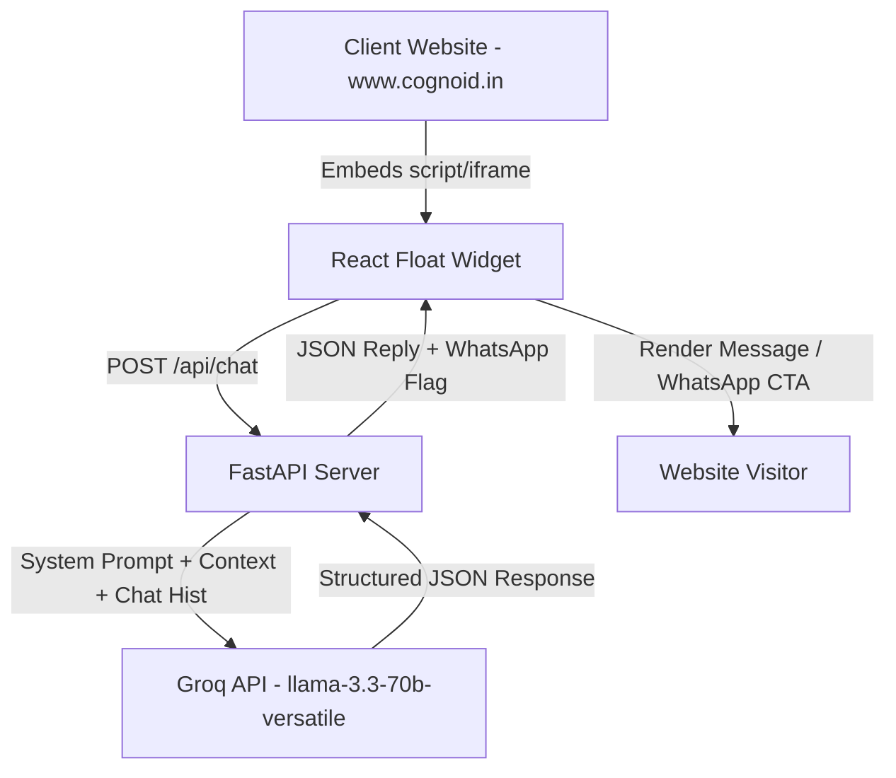

# Implementation Plan - Cognoid AI Chatbot Build System (Groq API)

This implementation plan details the architecture, file organization, development stages, and code components for the **Cognoid Embedded AI Website Chatbot** for **Cognoid Technology Solutions**, powered by **Groq API**.

---

## Goal & Architecture Overview

We are building a lightweight, production-grade, embeddable AI chatbot assistant widget that can be easily loaded on the existing [Cognoid Technology Solutions](https://www.cognoid.in/) website via a single script or iframe. 

### Architecture Flow


---

## Educational Architecture Blueprint: Why This Layout Exists

As a developer mastering full-stack systems, it is vital to understand the design choices behind our folders and files. Here is the technical and educational rationale for our architecture:

### 1. The Client-Server Security Boundary (Why separate FE/BE?)
*   **The Problem:** React runs inside the client's browser (visible to the user). If React directly called Groq, your private `GROQ_API_KEY` would be loaded in the user's browser, leaving it vulnerable to theft via basic inspector tools.
*   **The Solution:** The backend server runs privately on an isolated host (e.g. Railway). React communicates only with your backend, which securely holds the secret keys and makes requests to Groq on the backend.

### 2. Separation of Concerns (SoC) in the Backend
To avoid complex "spaghetti" files, we assign exactly one job to each file:

*   **`backend/app/config.py` (The Secretary):** Responsible only for reading the environment configuration (`.env`). If an environment variable is missing, it raises an error immediately at startup rather than crashing mid-user-chat.
*   **`backend/app/schema.py` (The Security Guard):** Outlines the strict data contract of the API using Pydantic models. It validates that incoming requests contain expected strings and guarantees that the server output matches the exact structure the React widget expects.
*   **`backend/app/services/groq_service.py` (The LLM Expert):** Handles the interface with Groq, orchestrating system prompts, context, temperature settings, and JSON output formats. Separating this means you can update the business prompt or change models without touching your API routes.
*   **`backend/app/main.py` (The Air Traffic Controller):** Sets up the FastAPI server, handles CORS policies (so the Vercel widget is permitted to make requests), and manages the high-level request-response loop.

### 3. Separation of Concerns (SoC) in the Frontend
*   **`useChat.js` (The Brains):** A React custom hook that encapsulates network fetching, loading indicators, and local chat state (lists of user and bot messages). This keeps UI components clean and focused purely on rendering visual layout.
*   **`components/` (The Visuals):** Tiny, reusable elements (Bubble, Window, Message, WhatsApp Button) that receive data via React `props` and render them with premium styles.

---

## User Review Required

> [!IMPORTANT]
> The backend relies on a **Groq API Key** (`GROQ_API_KEY`) and a **WhatsApp Phone Number** (`WHATSAPP_NUMBER`) to function properly.
>
> **WhatsApp Link Redirection Format**: We will use `https://wa.me/<number>` (incorporating the country code, e.g., `91XXXXXXXXXX` for India). Please ensure the phone number is set in international format without `+` or spaces (e.g. `919876543210`).

---

## Proposed Folder Structure

```
cognoid-chatbot/
├── backend/
│   ├── .env.example
│   ├── requirements.txt
│   └── app/
│       ├── __init__.py
│       ├── main.py
│       ├── config.py
│       ├── schema.py
│       └── services/
│           ├── __init__.py
│           └── groq_service.py
├── frontend/
│   ├── package.json
│   ├── vite.config.js
│   ├── index.html
│   └── src/
│       ├── main.jsx
│       ├── index.css
│       ├── App.jsx
│       ├── components/
│       │   ├── ChatBubble.jsx
│       │   ├── ChatWindow.jsx
│       │   ├── ChatMessage.jsx
│       │   └── WhatsAppButton.jsx
│       └── hooks/
│           └── useChat.js
├── README.md
└── embed-snippet.js
```

---

## Proposed Changes

### 1. Backend: FastAPI Server

#### [NEW] [config.py](file:///c:/Users/Krishna/Desktop/Cognoid%20Soln/backend/app/config.py)
Manages configuration and environment variables (`GROQ_API_KEY`, `WHATSAPP_NUMBER`, `FRONTEND_URL` for CORS).

#### [NEW] [schema.py](file:///c:/Users/Krishna/Desktop/Cognoid%20Soln/backend/app/schema.py)
Defines request and response validation structures.
- `ChatRequest`: `{"message": str}`
- `ChatResponse`: `{"reply": str, "show_whatsapp": bool, "whatsapp_link": Optional[str]}`

#### [NEW] [groq_service.py](file:///c:/Users/Krishna/Desktop/Cognoid%20Soln/backend/app/services/groq_service.py)
Integrates Groq SDK using the `llama-3.3-70b-versatile` model. 
- Employs a strict system instruction detailing **Cognoid Technology Solutions** (Services: Generative AI Solutions, IT Managed Services/ServiceNow, Infrastructure & Cloud, Cybersecurity, Workplace Transformation).
- Configures Groq's native JSON Mode to ensure a matching JSON signature is returned directly from the model, eliminating brittle regex parser logic.
- Implements strict escalation rules (direct user support, custom solutions, pricing/quotation, or enterprise consultation = `show_whatsapp = true`).

#### [NEW] [main.py](file:///c:/Users/Krishna/Desktop/Cognoid%20Soln/backend/app/main.py)
Exposes `POST /api/chat` and `GET /api/health`. Employs proper `CORSMiddleware` supporting CORS wildcard or configured URL to allow secure requests from the Vercel deployed frontend.

#### [NEW] [requirements.txt](file:///c:/Users/Krishna/Desktop/Cognoid%20Soln/backend/backend/requirements.txt)
Specifies project dependencies: `fastapi`, `uvicorn`, `groq`, `pydantic-settings`, `python-dotenv`.

---

### 2. Frontend: Embeddable React Chat Widget

We will initialize a clean Vite + React app with standard styling, then provide full scaffolding.

#### [NEW] [index.css](file:///c:/Users/Krishna/Desktop/Cognoid%20Soln/frontend/src/index.css)
Declares the theme variables (harmony-rich HSL-tailored colors, slate dark modes, deep gradients, glassmorphism filters, keyframes for micro-animations like entry bounces, pulsing indicators, and typing dots).

#### [NEW] [App.jsx](file:///c:/Users/Krishna/Desktop/Cognoid%20Soln/frontend/src/App.jsx)
Main entry point coordinating the toggle state between the floating Chat Bubble and the expanded Chat Window.

#### [NEW] [useChat.js](file:///c:/Users/Krishna/Desktop/Cognoid%20Soln/frontend/src/hooks/useChat.js)
Custom hook managing message queues, bot loading/typing states, API fetch operations to the FastAPI endpoint, and fallback states.

#### [NEW] [components](file:///c:/Users/Krishna/Desktop/Cognoid%20Soln/frontend/src/components/)
- **`ChatBubble`**: Floating trigger button situated at bottom-right with modern hover effects.
- **`ChatWindow`**: Sleek chat box containing:
  - Header: Branding (Cognoid), status indicator, close button.
  - Body: Scroll-locked list of messages, automatic scrolling to bottom.
  - Footer: Text input and send icon.
- **`ChatMessage`**: Visual bubbles representing user (aligned right, primary theme gradient) vs bot (aligned left, slate background). Incorporates the typing loader indicator.
- **`WhatsAppButton`**: Premium, high-visibility call-to-action button rendered in chat when escalation is triggered.

---

### 3. Website Embedding Strategy
We will construct an `embed-snippet.js` script containing a small shadow DOM injection script.
A client website can inject it via:
```html
<script src="https://your-vercel-domain.com/embed-snippet.js" defer></script>
```
This script dynamically spins up an iframe or directly mounts the widget on the host's document page inside a scoped shadow DOM container to completely avoid CSS conflicts with the client's existing pages!

---

## Verification Plan

### Automated & Manual Verification
1. **Backend Testing**:
   - Run the FastAPI backend: `uvicorn app.main:app --reload`
   - Test health check: `GET http://localhost:8000/api/health`
   - Test business queries (e.g. services, hours) via REST client or `curl` to ensure `show_whatsapp = false`.
   - Test escalation queries (e.g. "How much do you charge?", "Let's build a custom project") to ensure `show_whatsapp = true` and `whatsapp_link` is correctly populated with the configured phone number.

2. **Frontend Testing**:
   - Start the Vite development server: `npm run dev`
   - Verify layout responsiveness on desktop and simulated mobile views.
   - Verify glassmorphic blur, modern gradient visual aesthetics, and micro-animations.
   - Run interactive chats and confirm correct API integration and WhatsApp redirect action.

---

## Supervisor Prompts for Claude Code CLI

As supervisor, once the backend is fully functional and frontend scaffolded, we will provide the user with copy-pasteable prompts to execute in their local terminal with Claude Code. This will ensure extremely fast, accurate execution of the UI layouts.
